<div align="center">


# HexStrike AI MCP Agents v6.0
### AI-Powered MCP Cybersecurity Automation Platform

[](https://www.python.org/)
[](https://hub.docker.com)
[](LICENSE)
[](https://github.com/0x4m4/hexstrike-ai)
[](https://github.com/0x4m4/hexstrike-ai)
[](https://github.com/0x4m4/hexstrike-ai/releases)
[](https://github.com/0x4m4/hexstrike-ai)
[](https://github.com/0x4m4/hexstrike-ai)
[](https://github.com/0x4m4/hexstrike-ai)

**Advanced AI-powered penetration testing MCP framework with 150+ security tools and 12+ autonomous AI agents**

[⚡ Quick Start](QUICKSTART.md) • [🐳 Docker Guide](DOCKER.md) • [🏗️ Architecture](#architecture-overview) • [🚀 Installation](#installation) • [🛠️ Features](#features) • [🤖 AI Agents](#ai-agents) • [📡 API Reference](#api-reference)

---
# 🤖 HexStrike AI - AI/MCP 滲透測試架構深度解析

## 📋 概述

HexStrike AI 是一個**以 AI 為核心**的自動化滲透測試平台，深度整合了 **MCP (Model Context Protocol)** 和多個 **AI Intelligence Agents**，實現了真正的智能化安全測試。

---

## 🎯 核心概念：AI-Driven Penetration Testing

### 什麼是 MCP？

**MCP (Model Context Protocol)** 是一個讓 AI 代理（如 Claude、GPT）可以直接控制工具和服務的協議。

在 HexStrike AI 中：
- **AI 不只是輔助**，而是**主動執行**滲透測試
- **自然語言控制**：用戶用自然語言下達指令 → AI 轉換為工具執行
- **智能決策**：AI 根據掃描結果自動選擇下一步行動

---

## 🏗️ 三層 AI 架構

### 第 1 層：MCP 通訊層
```
用戶自然語言指令
    ↓
AI 代理 (Claude Desktop / GPT)
    ↓ [MCP Protocol]
hexstrike_mcp.py (MCP Server)
    ↓ [HTTP API]
hexstrike_server.py (Flask API)
    ↓ [Subprocess]
安全工具 (Nmap, Nuclei, SQLMap...)
```

**實際應用範例**：
```
用戶對 Claude 說：
"掃描 example.com 並找出所有可能的 SQL 注入點"

Claude 透過 MCP 執行：
1. nmap_scan("example.com")  # 端口掃描
2. httpx_probe("example.com")  # 探測 web 服務
3. katana_crawl("example.com")  # 爬取所有 URL
4. sqlmap_scan(..., auto_params)  # 自動測試 SQL 注入
5. 分析結果並生成報告
```

### 第 2 層：AI 決策引擎 (IntelligentDecisionEngine)

這是核心的 **AI-powered 工具選擇和參數優化引擎**。

#### 核心功能

**1. 目標分析與分類**
```python
class IntelligentDecisionEngine:
    def analyze_target(self, target: str) -> TargetProfile:
        """AI 分析目標並建立 profile"""
        # 自動識別目標類型
        - Web Application
        - API Endpoint
        - Network Host
        - Binary File
        - Cloud Service
        - Mobile App
        
        # 技術棧指紋識別
        - WordPress/Joomla/Drupal
        - PHP/Python/Node.js
        - Apache/Nginx/IIS
        - AWS/Azure/GCP
```

**2. 智能工具選擇**
```python
def select_optimal_tools(self, profile: TargetProfile, objective: str):
    """根據目標特徵選擇最有效的工具"""
    
    # AI 評分系統 (0.0 - 1.0)
    tool_effectiveness = {
        "WEB_APPLICATION": {
            "nuclei": 0.95,     # 漏洞掃描最有效
            "dalfox": 0.93,     # XSS 檢測高分
            "wpscan": 0.95,     # WordPress 專用
            "gobuster": 0.9,    # 目錄爆破
            "sqlmap": 0.9,      # SQL 注入
        },
        "NETWORK_HOST": {
            "nmap": 0.95,       # 端口掃描王者
            "rustscan": 0.9,    # 超快速掃描
            "masscan": 0.88,    # 大規模掃描
        },
        "BINARY_FILE": {
            "ghidra": 0.95,     # 逆向工程
            "radare2": 0.9,     # 二進制分析
            "checksec": 0.85,   # 安全檢查
        }
    }
```

**3. 自動參數優化**
```python
def optimize_parameters(self, tool: str, profile: TargetProfile):
    """AI 根據目標特徵優化工具參數"""
    
    # 範例：Nmap 參數優化
    if tool == "nmap":
        if profile.is_highly_secured:
            # 高安全目標 → 隱蔽掃描
            return {
                "timing": "-T2",      # 慢速掃描
                "scan_type": "-sS",   # SYN 掃描
                "evasion": "--randomize-hosts"
            }
        elif profile.is_time_sensitive:
            # 時間敏感 → 快速掃描
            return {
                "timing": "-T4",
                "scan_type": "-sT",
                "ports": "top-1000"
            }
```

**4. 攻擊鏈建構 (Attack Chain Creation)**
```python
def create_attack_chain(self, profile: TargetProfile, objective: str):
    """AI 建構智能攻擊鏈"""
    
    # Web 應用攻擊鏈範例
    if target_type == "WEB_APPLICATION":
        return [
            # Phase 1: 偵察
            {"tool": "nmap", "priority": 1, "params": {...}},
            {"tool": "httpx", "priority": 1, "params": {...}},
            
            # Phase 2: 資訊收集
            {"tool": "katana", "priority": 2, "params": {...}},
            {"tool": "subfinder", "priority": 2, "params": {...}},
            
            # Phase 3: 漏洞掃描
            {"tool": "nuclei", "priority": 3, "params": {...}},
            {"tool": "dalfox", "priority": 3, "params": {...}},
            
            # Phase 4: 深度測試
            {"tool": "sqlmap", "priority": 4, "params": {...}},
            {"tool": "wpscan", "priority": 4, "params": {...}},
        ]
    
    # CTF 二進制攻擊鏈
    elif objective == "ctf":
        return [
            {"tool": "file", "priority": 1},
            {"tool": "checksec", "priority": 1},
            {"tool": "strings", "priority": 2},
            {"tool": "ghidra", "priority": 3},
            {"tool": "pwntools", "priority": 4}
        ]
```

#### 技術實作：規則型決策引擎 vs 真正的 AI

當前的 IntelligentDecisionEngine 採用**規則型啟發式演算法**，而非基於大型語言模型（LLM）。以下是其運作原理：

##### 1. 靜態評分系統 (Static Scoring System)

引擎維護預定義的工具效能評分表，針對不同目標類型給予固定分數：

- Web 應用：nuclei (0.95), dalfox (0.93), wpscan (0.95)
- 網路主機：nmap (0.95), rustscan (0.9), masscan (0.92)
- 二進制檔案：ghidra (0.95), radare2 (0.9), checksec (0.85)

這些分數是**靜態的**，由安全專家根據經驗預先設定，不會根據實際掃描結果動態調整。

##### 2. 規則型目標識別 (Rule-based Target Identification)

使用正則表達式和字串比對判斷目標類型：

```python
if target.startswith('http://') or target.startswith('https://'):
    return TargetType.WEB_APPLICATION
elif re.match(r'^(\d{1,3}\.){3}\d{1,3}$', target):
    return TargetType.NETWORK_HOST
elif target.endswith(('.exe', '.bin', '.elf')):
    return TargetType.BINARY_FILE
```

##### 3. 預定義攻擊模式 (Predefined Attack Patterns)

系統包含 15+ 種預先編排的攻擊鏈模板，例如：
- `web_reconnaissance`：nmap → httpx → katana → nuclei
- `bug_bounty_high_impact`：nuclei (critical) → sqlmap → jaeles
- `ctf_pwn_challenge`：pwninit → checksec → ghidra → ropper

##### 4. 條件式參數優化 (Conditional Parameter Optimization)

基於 if-else 邏輯調整工具參數：

```python
if technology == TechnologyStack.WORDPRESS:
    use_wpscan()
elif stealth_mode:
    nmap_timing = "-T2"  # 慢速掃描
else:
    nmap_timing = "-T4"  # 快速掃描
```

#### 限制與優勢

**限制：**
- 無學習能力：無法從歷史掃描結果學習和改進
- 規則死板：無法處理未預見的目標類型或複雜情境
- 缺乏語境理解：不理解漏洞的業務影響或攻擊者視角
- 無創造性：只能執行預定義的攻擊策略

**優勢：**
- 快速響應：無需 API 呼叫，毫秒級決策
- 可預測性：行為一致，易於除錯
- 無成本：不需要 LLM API 費用
- 離線運作：無需網路連線

#### 未來升級方向：整合真正的 LLM

v7.0 將整合 OpenAI GPT-4 + LangChain，實現：
- 動態學習：根據掃描結果自動調整工具評分
- 語境分析：理解業務邏輯漏洞和複雜攻擊鏈
- 創意思考：生成自訂 exploit 和繞過技術
- 自然語言交互：直接理解安全研究員的測試意圖

---

### 第 3 層：專業 AI Intelligence Managers

**1. CVE Intelligence Manager**
```python
class CVEIntelligenceManager:
    """CVE 漏洞情報管理與利用生成"""
    
    def analyze_cve(self, cve_id: str):
        """分析 CVE 並提取關鍵資訊"""
        # AI 解析 CVE 描述
        # 提取攻擊向量、影響版本、CVSS 分數
    
    def generate_exploit(self, cve_data: dict):
        """AI 自動生成 exploit 代碼"""
        # 根據漏洞類型生成專業 exploit
        # 支援：RCE, SQLi, XSS, Buffer Overflow, etc.
```

**2. AI Exploit Generator**
```python
class AIExploitGenerator:
    """AI 驅動的 exploit 生成器"""
    
    def generate_intelligent_exploit(self, vulnerability_data: dict):
        """根據漏洞資訊生成智能 exploit"""
        
        # 支援的 exploit 類型
        - Buffer Overflow (x86/x64/ARM)
        - Remote Code Execution
        - SQL Injection
        - Cross-Site Scripting
        - Deserialization
        - Authentication Bypass
        - File Read/LFI
        - XXE Injection
        
        # AI 特性
        - 自動 ROP chain 建構
        - Payload 混淆與編碼
        - 繞過 WAF/IDS 技術
        - Multi-stage payloads
```

**3. Vulnerability Correlator**
```python
class VulnerabilityCorrelator:
    """漏洞關聯分析與利用鏈建構"""
    
    def correlate_vulnerabilities(self, findings: list):
        """AI 分析多個漏洞並建構攻擊鏈"""
        
        # 範例：
        # 1. 發現 LFI 漏洞
        # 2. 發現 SSH 服務
        # 3. AI 建議：LFI 讀取 SSH 私鑰 → 登入系統
        
        return {
            "attack_chain": [
                "exploit_lfi_to_read_ssh_key",
                "use_ssh_key_for_login",
                "escalate_privileges"
            ],
            "risk_level": "critical",
            "estimated_impact": "full_system_compromise"
        }
```

---

## 🔧 實際應用場景

### 場景 1：Bug Bounty 自動化

**用戶輸入**（對 Claude 說）：
```
"對 hackerone.com/test-site 進行完整的 bug bounty 測試，
重點關注 OWASP Top 10 漏洞"
```

**AI 自動執行**：
```python
# Phase 1: AI 分析目標
profile = decision_engine.analyze_target("test-site.com")
# 結果：Web Application, PHP, WordPress 5.8, Nginx

# Phase 2: AI 選擇工具
tools = decision_engine.select_optimal_tools(profile, "bug_bounty")
# 選中：nuclei, wpscan, dalfox, sqlmap, ffuf

# Phase 3: AI 建構攻擊鏈
chain = decision_engine.create_attack_chain(profile, "bug_bounty")

# Phase 4: 並行執行
results = execute_parallel(chain)

# Phase 5: AI 關聯分析
vulnerabilities = correlator.correlate_vulnerabilities(results)

# Phase 6: AI 生成報告
report = generate_bug_bounty_report(vulnerabilities)
```

### 場景 2：CTF 自動化解題

**用戶輸入**：
```
"這是一個 ELF 二進制文件，幫我找出漏洞並生成 exploit"
```

**AI 執行流程**：
```python
# 1. 文件分析
file_info = analyze_file("binary")
# 2. 安全檢查
security = checksec("binary")
# 3. 字串提取
strings = extract_strings("binary")
# 4. 反彙編分析
disasm = ghidra_analyze("binary")
# 5. 漏洞識別
vulns = identify_vulnerabilities(disasm)
# 6. Exploit 生成
exploit = generate_buffer_overflow_exploit(vulns[0])
# 7. 自動測試
test_exploit(exploit)
```

### 場景 3：API 安全測試

**用戶輸入**：
```
"測試這個 REST API 的安全性：https://api.example.com"
```

**AI 工作流程**：
```python
# 1. API 發現
endpoints = discover_api_endpoints("https://api.example.com")

# 2. Schema 分析
schema = analyze_api_schema(endpoints)

# 3. 認證測試
auth_vulns = test_authentication_bypasses()

# 4. 參數模糊測試
param_vulns = fuzz_api_parameters()

# 5. 注入測試
injection_vulns = test_injections(["sqli", "nosqli", "xss"])

# 6. 權限測試
authz_vulns = test_authorization_issues()

# 7. 生成專業報告
report = generate_api_security_report()
```

---

## 🎨 MCP Tools 範例

### 100+ MCP Tools 分類

HexStrike 透過 MCP 暴露 **100+ 安全工具**給 AI 代理：

#### 網路偵察 (Network Reconnaissance)
```python
@mcp.tool()
def nmap_scan(target, scan_type, ports, additional_args):
    """AI 可呼叫：Nmap 端口掃描"""
    
@mcp.tool()
def rustscan_scan(target, ulimit, batch_size):
    """AI 可呼叫：超快速端口掃描"""
    
@mcp.tool()
def masscan_scan(target, rate, ports):
    """AI 可呼叫：大規模掃描"""
```

#### Web 應用測試 (Web Application Testing)
```python
@mcp.tool()
def nuclei_scan(target, severity, templates):
    """AI 可呼叫：漏洞掃描（3000+ 模板）"""
    
@mcp.tool()
def dalfox_scan(url, mining_dom, custom_payload):
    """AI 可呼叫：先進 XSS 檢測"""
    
@mcp.tool()
def sqlmap_scan(url, data, level, risk):
    """AI 可呼叫：SQL 注入檢測"""
```

#### AI 增強功能 (AI-Enhanced Features)
```python
@mcp.tool()
def intelligent_smart_scan(target, objective, max_tools):
    """AI 智能掃描：自動選擇工具並執行"""
    # AI 分析 → 選擇 → 執行 → 關聯 → 報告
    
@mcp.tool()
def create_attack_chain(target, objective):
    """建構智能攻擊鏈"""
    
@mcp.tool()
def advanced_payload_generation(attack_type, target_context, evasion_level):
    """AI 生成進階 payload（含 WAF 繞過）"""
```

---

## 🧠 AI 決策範例

### 範例 1：WordPress 網站自動化測試

**AI 思考過程**：
```
1. 檢測到目標：example.com
2. Fingerprint 識別：WordPress 5.8.3
3. 技術棧分析：PHP 7.4, Apache 2.4, Linux
4. 決策：
   ✅ wpscan (0.95 effectiveness for WordPress)
   ✅ nuclei (0.95 general vulnerability scanning)
   ✅ dalfox (0.93 for XSS in plugins)
   ❌ ghidra (0.1 - not relevant for web)
   
5. 參數優化：
   wpscan: --api-token [auto], --enumerate [ap,vp,u]
   nuclei: --severity critical,high --tags wordpress
   
6. 執行順序：
   parallel: [wpscan, nuclei]  # 可並行
   sequential: [dalfox]  # 需要前面結果
```

### 範例 2：雲端安全評估

**AI 決策**：
```
1. 識別：AWS 雲端環境
2. 工具選擇：
   - prowler (0.95 for AWS)
   - trivy (0.9 for container security)
   - kube-hunter (0.88 for K8s)
   
3. 攻擊鏈：
   Phase 1: Cloud posture assessment (prowler)
   Phase 2: Container scanning (trivy)
   Phase 3: K8s security (kube-hunter)
   Phase 4: IAM analysis (custom scripts)
```

---

## 📊 AI 效能指標

### 智能化程度

| 功能 | 傳統工具 | HexStrike AI |
|------|---------|--------------|
| 工具選擇 | 手動 | ✅ AI 自動（based on target profile）|
| 參數調整 | 手動 | ✅ AI 優化（context-aware）|
| 執行順序 | 手動 | ✅ AI 排程（intelligent chaining）|
| 結果關聯 | 手動 | ✅ AI 分析（vulnerability correlation）|
| Exploit 生成 | 手動 | ✅ AI 自動（multi-technique）|
| 繞過技術 | 手動 | ✅ AI 適應（evasion optimization）|

### 自動化程度

- **0% 手動介入**：AI 完全自主決策
- **自然語言控制**：用戶只需描述目標
- **持續學習**：工具效能評分會根據歷史結果調整

---

## 🔐 安全與倫理

### 授權與合規

```python
# 所有 AI 操作都記錄並需要授權
@require_authorization
def execute_security_test(target):
    """所有測試需要明確授權"""
    
    # 記錄所有操作
    log_action(user, target, tools_used, timestamp)
    
    # 僅用於授權測試
    assert user.has_authorization_for(target)
```

### 使用聲明

```
⚠️ HexStrike AI 僅用於授權的安全測試
- Bug Bounty Programs（有授權的漏洞賞金計畫）
- Penetration Testing（滲透測試合約）
- CTF Competitions（CTF 競賽）
- Security Research（安全研究）

❌ 禁止用於未經授權的攻擊或非法活動
```

---

## 🚀 如何使用 AI/MCP 功能

### 方法 1：Claude Desktop 整合

1. **安裝 Claude Desktop**
2. **配置 MCP**：
```json
{
  "mcpServers": {
    "hexstrike": {
      "command": "python",
      "args": ["hexstrike_mcp.py", "--server-url", "http://localhost:8888"]
    }
  }
}
```
3. **重啟 Claude**
4. **開始使用**：
```
用戶："掃描 example.com 並找出所有漏洞"
Claude：[自動執行 nmap → httpx → nuclei → 生成報告]
```

### 方法 2：直接 API 呼叫

```bash
# AI 智能掃描
curl -X POST https://hexstrike-ai.dennisleehappy.org/api/intelligence/smart-scan \
  -H "Content-Type: application/json" \
  -d '{
    "target": "example.com",
    "objective": "bug_bounty",
    "max_tools": 5
  }'

# AI 建構攻擊鏈
curl -X POST https://hexstrike-ai.dennisleehappy.org/api/intelligence/create-attack-chain \
  -H "Content-Type: application/json" \
  -d '{
    "target": "example.com",
    "objective": "comprehensive"
  }'
```

### 方法 3：前端 UI

前端提供 **AI Analysis Dashboard**：
- 自動目標分析
- 智能工具推薦
- 一鍵執行攻擊鏈
- 即時結果可視化

---

## 📚 技術文件

### 相關文件
1. **docs/MCP_INTEGRATION.md** - MCP 整合詳細說明
2. **Documentations/AI_CLIENT_SETUP_GUIDE.md** - AI 客戶端設定
3. **hexstrike_mcp.py** - MCP 伺服器實作（4200+ 行）
4. **core/decision_engine.py** - AI 決策引擎核心

### API 端點
- `/api/intelligence/smart-scan` - AI 智能掃描
- `/api/intelligence/create-attack-chain` - 攻擊鏈建構
- `/api/ai/advanced-payload-generation` - AI payload 生成
- `/api/ai/correlation-analysis` - 漏洞關聯分析

---

## 🎯 總結

### HexStrike AI 的 AI/MCP 滲透測試優勢

✅ **完全自動化**：AI 主導整個滲透測試流程  
✅ **智能決策**：根據目標特徵自動選擇最佳工具  
✅ **自然語言控制**：用戶用人類語言下達指令  
✅ **持續優化**：AI 根據歷史結果調整策略  
✅ **專業級輸出**：自動生成符合行業標準的報告  

### 為什麼這是革命性的？

1. **降低門檻**：新手也能執行專家級測試
2. **提高效率**：AI 並行執行多個工具
3. **減少誤報**：智能關聯分析過濾假陽性
4. **持續演進**：工具效能持續學習優化

---

**HexStrike AI = 150+ 工具 + AI 大腦 + MCP 協議 = 真正的智能滲透測試平台** 🚀

---

**版本**: 6.0.1  
**更新日期**: 2025-11-04  
**狀態**: ✅ Production Ready


---

## ⚡ Quick Start (Docker)

### 🐳 Docker Hub (Recommended - Fastest Setup)

```bash
# Pull and run from Docker Hub (no build required)
docker run -d -p 8888:8888 --name hexstrike dennisleetw/hexstrike-ai:latest

# Access at http://localhost:8888
# Check logs: docker logs -f hexstrike
```

### 🔨 Local Build (Development)

```bash
# One-command deployment (requires Docker)
git clone https://github.com/0x4m4/hexstrike-ai.git && cd hexstrike-ai
make deploy-local  # Build, run, and test in one command

# Access at http://localhost:8888
```

📖 **New to Docker?** Read the [Quick Start Guide](QUICKSTART.md) | Full [Docker Deployment Guide](DOCKER.md)

</div>

---

<div align="center">

## Follow Our Social Accounts

<p align="center">
  <a href="https://discord.gg/BWnmrrSHbA">
    
  </a>
  &nbsp;&nbsp;
  <a href="https://www.linkedin.com/company/hexstrike-ai">
    
  </a>
</p>


</div>

---

## Architecture Overview

HexStrike AI MCP v6.0 features a multi-agent architecture with autonomous AI agents, intelligent decision-making, and vulnerability intelligence.

```mermaid
%%{init: {"themeVariables": {
  "primaryColor": "#b71c1c",
  "secondaryColor": "#ff5252",
  "tertiaryColor": "#ff8a80",
  "background": "#2d0000",
  "edgeLabelBackground":"#b71c1c",
  "fontFamily": "monospace",
  "fontSize": "16px",
  "fontColor": "#fffde7",
  "nodeTextColor": "#fffde7"
}}}%%
graph TD
    A[AI Agent - Claude/GPT/Copilot] -->|MCP Protocol| B[HexStrike MCP Server v6.0]
    
    B --> C[Intelligent Decision Engine]
    B --> D[12+ Autonomous AI Agents]
    B --> E[Modern Visual Engine]
    
    C --> F[Tool Selection AI]
    C --> G[Parameter Optimization]
    C --> H[Attack Chain Discovery]
    
    D --> I[BugBounty Agent]
    D --> J[CTF Solver Agent]
    D --> K[CVE Intelligence Agent]
    D --> L[Exploit Generator Agent]
    
    E --> M[Real-time Dashboards]
    E --> N[Progress Visualization]
    E --> O[Vulnerability Cards]
    
    B --> P[150+ Security Tools]
    P --> Q[Network Tools - 25+]
    P --> R[Web App Tools - 40+]
    P --> S[Cloud Tools - 20+]
    P --> T[Binary Tools - 25+]
    P --> U[CTF Tools - 20+]
    P --> V[OSINT Tools - 20+]
    
    B --> W[Advanced Process Management]
    W --> X[Smart Caching]
    W --> Y[Resource Optimization]
    W --> Z[Error Recovery]
    
    style A fill:#b71c1c,stroke:#ff5252,stroke-width:3px,color:#fffde7
    style B fill:#ff5252,stroke:#b71c1c,stroke-width:4px,color:#fffde7
    style C fill:#ff8a80,stroke:#b71c1c,stroke-width:2px,color:#fffde7
    style D fill:#ff8a80,stroke:#b71c1c,stroke-width:2px,color:#fffde7
    style E fill:#ff8a80,stroke:#b71c1c,stroke-width:2px,color:#fffde7
```



How to Use  HexStrike AI
Method 1: Web Interface (After next deployment)
Navigate to: https://hexstrike-ai-v6-0.onrender.com
Use the interactive dashboard for real-time security testing
Method 2: Direct API Usage (Available now)
Base URL: https://hexstrike-ai-v6-0.onrender.com
Use curl commands or custom clients
Reference API_USAGE.md for complete documentation
Method 3: AI Client Integration (Ready to configure)
Follow AI_CLIENT_SETUP_GUIDE.md for your specific AI client
Use natural language prompts for security testing
Example: "I'm authorized to test example.com. Please use hexstrike AI tools to perform a security assessment."
📚 Documentation Available
API_USAGE.md - Complete API documentation with examples
AI_CLIENT_SETUP_GUIDE.md - AI client integration guide
USAGE_EXAMPLES.md - Practical examples for all methods
DEPLOYMENT_TEST_RESULTS.md - Test results and quick start guide

### How It Works

1. **AI Agent Connection** - Claude, GPT, or other MCP-compatible agents connect via FastMCP protocol
2. **Intelligent Analysis** - Decision engine analyzes targets and selects optimal testing strategies
3. **Autonomous Execution** - AI agents execute comprehensive security assessments
4. **Real-time Adaptation** - System adapts based on results and discovered vulnerabilities
5. **Advanced Reporting** - Visual output with vulnerability cards and risk analysis

---

## Installation

### Quick Setup to Run the hexstrike MCPs Server

```bash
# 1. Clone the repository
git clone https://github.com/0x4m4/hexstrike-ai.git
cd hexstrike-ai

# 2. Create virtual environment
python3 -m venv hexstrike-env
source hexstrike-env/bin/activate  # Linux/Mac
# hexstrike-env\Scripts\activate   # Windows

# 3. Install Python dependencies
pip3 install -r requirements.txt

```

### Installation and Setting Up Guide for various AI Clients:

#### Installation & Demo Video

Watch the full installation and setup walkthrough here: [YouTube - HexStrike AI Installation & Demo](https://www.youtube.com/watch?v=pSoftCagCm8)

#### Supported AI Clients for Running & Integration

You can install and run HexStrike AI MCPs with various AI clients, including:

- **5ire (Latest version v0.14.0 not supported for now)**
- **VS Code Copilot**
- **Roo Code**
- **Cursor**
- **Claude Desktop**
- **Any MCP-compatible agent**

Refer to the video above for step-by-step instructions and integration examples for these platforms.


### Install Security Tools

**Core Tools (Essential):**
```bash
# Network & Reconnaissance
nmap masscan rustscan amass subfinder nuclei fierce dnsenum
autorecon theharvester responder netexec enum4linux-ng

# Web Application Security
gobuster feroxbuster dirsearch ffuf dirb httpx katana
nikto sqlmap wpscan arjun paramspider dalfox wafw00f

# Password & Authentication
hydra john hashcat medusa patator crackmapexec
evil-winrm hash-identifier ophcrack

# Binary Analysis & Reverse Engineering
gdb radare2 binwalk ghidra checksec strings objdump
volatility3 foremost steghide exiftool
```

**Cloud Security Tools:**
```bash
prowler scout-suite trivy
kube-hunter kube-bench docker-bench-security
```

**Browser Agent Requirements:**
```bash
# Chrome/Chromium for Browser Agent
sudo apt install chromium-browser chromium-chromedriver
# OR install Google Chrome
wget -q -O - https://dl.google.com/linux/linux_signing_key.pub | sudo apt-key add -
echo "deb [arch=amd64] http://dl.google.com/linux/chrome/deb/ stable main" | sudo tee /etc/apt/sources.list.d/google-chrome.list
sudo apt update && sudo apt install google-chrome-stable
```

### Start the Server

```bash
# Start the MCP server
python3 hexstrike_server.py

# Optional: Start with debug mode
python3 hexstrike_server.py --debug

# Optional: Custom port configuration
python3 hexstrike_server.py --port 8888
```

### Verify Installation

```bash
# Test server health
curl http://localhost:8888/health

# Test AI agent capabilities
curl -X POST http://localhost:8888/api/intelligence/analyze-target \
  -H "Content-Type: application/json" \
  -d '{"target": "example.com", "analysis_type": "comprehensive"}'
```

---

## Docker Deployment

### Quick Start with Docker

HexStrike AI v6.0 now supports Docker deployment with pre-installed 150+ security tools for instant setup.

#### 🚀 Docker Hub (Recommended - No Build Required)

**English:**
```bash
# Pull and run the latest image from Docker Hub
docker run -d -p 8888:8888 --name hexstrike dennisleetw/hexstrike-ai:latest

# Check server health
curl http://localhost:8888/health

# View logs
docker logs -f hexstrike

# Stop the container
docker stop hexstrike && docker rm hexstrike
```

**中文說明：**
```bash
# 從 Docker Hub 拉取並運行最新映像（無需構建）
docker run -d -p 8888:8888 --name hexstrike dennisleetw/hexstrike-ai:latest

# 檢查服務器健康狀態
curl http://localhost:8888/health

# 查看日誌
docker logs -f hexstrike

# 停止容器
docker stop hexstrike && docker rm hexstrike
```

#### 🔨 Build and Run Locally (Development)

**English:**
```bash
# 1. Build the Docker image
docker build -t hexstrike-ai:v6.0 .

# 2. Run the container
docker run -d -p 8888:8888 --name hexstrike hexstrike-ai:v6.0

# 3. Check server health
curl http://localhost:8888/health

# 4. View logs
docker logs -f hexstrike
```

**中文說明：**
```bash
# 1. 構建 Docker 映像
docker build -t hexstrike-ai:v6.0 .

# 2. 運行容器
docker run -d -p 8888:8888 --name hexstrike hexstrike-ai:v6.0

# 3. 檢查服務器健康狀態
curl http://localhost:8888/health

# 4. 查看日誌
docker logs -f hexstrike
```

#### 📦 Using Docker Compose (Recommended)

**English:**
```bash
# Start the service
docker-compose up -d

# View logs
docker-compose logs -f

# Stop the service
docker-compose down
```

**中文說明：**
```bash
# 啟動服務
docker-compose up -d

# 查看日誌
docker-compose logs -f

# 停止服務
docker-compose down
```

#### 🛠️ Using Makefile (Easiest)

For simplified management, use the included Makefile:

**English:**
```bash
# Show all available commands
make help

# Build, run, and test (all-in-one)
make deploy-local

# Individual commands
make build          # Build Docker image
make run            # Start with docker-compose
make logs           # View logs
make test           # Run health checks
make stop           # Stop containers
make clean          # Clean up everything
```

**中文說明：**
```bash
# 顯示所有可用命令
make help

# 構建、運行和測試（一鍵完成）
make deploy-local

# 單獨命令
make build          # 構建 Docker 映像
make run            # 使用 docker-compose 啟動
make logs           # 查看日誌
make test           # 運行健康檢查
make stop           # 停止容器
make clean          # 清理所有內容
```

### 🌐 Deploy to Cloud Platforms (Free/Cheap Options)

#### 🚂 Railway Deployment

**English:**
1. Connect your GitHub repository to [Railway](https://railway.app)
2. Create a new project and select your repository
3. Railway will automatically detect the `Dockerfile`
4. Set environment variables (optional):
   - `HEXSTRIKE_PORT=8888`
5. Deploy and get your public URL: `https://your-app.railway.app`

**中文說明：**
1. 將您的 GitHub 存儲庫連接到 [Railway](https://railway.app)
2. 創建新項目並選擇您的存儲庫
3. Railway 將自動檢測 `Dockerfile`
4. 設置環境變量（可選）：
   - `HEXSTRIKE_PORT=8888`
5. 部署並獲取您的公共 URL：`https://your-app.railway.app`

**Configuration**: Uses `railway.toml` for automatic deployment settings.

#### 🎨 Render Deployment

**English:**
1. Sign up at [Render](https://render.com)
2. Create a new **Web Service** from Git repository
3. Select **Docker** as environment
4. Render will use the `render.yaml` configuration
5. Deploy and access via: `https://your-app.onrender.com`

**中文說明：**
1. 在 [Render](https://render.com) 註冊
2. 從 Git 存儲庫創建新的 **Web Service**
3. 選擇 **Docker** 作為環境
4. Render 將使用 `render.yaml` 配置
5. 部署並通過以下方式訪問：`https://your-app.onrender.com`

**Free Tier**: 750 hours/month, automatic HTTPS, global CDN.

#### 🚀 Fly.io Deployment

**English:**
```bash
# 1. Install Fly CLI
curl -L https://fly.io/install.sh | sh

# 2. Login to Fly.io
fly auth login

# 3. Launch the app (uses fly.toml)
fly launch

# 4. Deploy
fly deploy

# 5. Open in browser
fly open
```

**中文說明：**
```bash
# 1. 安裝 Fly CLI
curl -L https://fly.io/install.sh | sh

# 2. 登錄 Fly.io
fly auth login

# 3. 啟動應用程序（使用 fly.toml）
fly launch

# 4. 部署
fly deploy

# 5. 在瀏覽器中打開
fly open
```

**Free Tier**: 3 shared-cpu-1x VMs with 256MB RAM each.

### 🔧 MCP Client Configuration for Docker Deployment

After deploying to a VPS, update your AI client's MCP configuration:

#### 🖥️ Claude Desktop Configuration

**English:**
Edit `~/.config/Claude/claude_desktop_config.json`:
```json
{
  "mcpServers": {
    "hexstrike-ai": {
      "command": "python3",
      "args": [
        "/path/to/hexstrike_mcp.py",
        "--server",
        "https://your-app.railway.app"
      ],
      "description": "HexStrike AI v6.0 - Cloud Deployed",
      "timeout": 300
    }
  }
}
```

**中文說明：**
編輯 `~/.config/Claude/claude_desktop_config.json`：
```json
{
  "mcpServers": {
    "hexstrike-ai": {
      "command": "python3",
      "args": [
        "/path/to/hexstrike_mcp.py",
        "--server",
        "https://your-app.railway.app"
      ],
      "description": "HexStrike AI v6.0 - 雲端部署",
      "timeout": 300
    }
  }
}
```

#### 💻 Cursor/VS Code Configuration

**English:**
Update `.vscode/settings.json`:
```json
{
  "servers": {
    "hexstrike": {
      "type": "stdio",
      "command": "python3",
      "args": [
        "/path/to/hexstrike_mcp.py",
        "--server",
        "https://your-app.railway.app"
      ]
    }
  },
  "inputs": []
}
```

**中文說明：**
更新 `.vscode/settings.json`：
```json
{
  "servers": {
    "hexstrike": {
      "type": "stdio",
      "command": "python3",
      "args": [
        "/path/to/hexstrike_mcp.py",
        "--server",
        "https://your-app.railway.app"
      ]
    }
  },
  "inputs": []
}
```

See `hexstrike-ai-mcp.example.json` for more deployment examples.

### ⚙️ Environment Variables

**English:**
Copy `env.example` to `.env` and customize:
```bash
HEXSTRIKE_PORT=8888          # Server port
HEXSTRIKE_HOST=0.0.0.0       # Bind address
CACHE_SIZE=1000              # Result cache size
CACHE_TTL=3600               # Cache TTL in seconds
COMMAND_TIMEOUT=300          # Command timeout
```

**中文說明：**
複製 `env.example` 到 `.env` 並自定義：
```bash
HEXSTRIKE_PORT=8888          # 服務器端口
HEXSTRIKE_HOST=0.0.0.0       # 綁定地址
CACHE_SIZE=1000              # 結果緩存大小
CACHE_TTL=3600               # 緩存 TTL（秒）
COMMAND_TIMEOUT=300          # 命令超時
```

### 🐳 Docker Image Details

**English:**
- **Base Image**: Kali Linux Rolling (latest security tools)
- **Size**: ~12.2GB (150+ pre-installed security tools)
- **Startup Time**: 30-60 seconds (tool verification)
- **Memory**: 2GB minimum, 4GB recommended
- **Included Tools**: nmap, gobuster, nuclei, sqlmap, hydra, ghidra, and 145+ more
- **Docker Hub**: `dennisleetw/hexstrike-ai:latest`

**中文說明：**
- **基礎映像**：Kali Linux Rolling（最新安全工具）
- **大小**：約 12.2GB（預裝 150+ 安全工具）
- **啟動時間**：30-60 秒（工具驗證）
- **內存**：最少 2GB，推薦 4GB
- **包含工具**：nmap、gobuster、nuclei、sqlmap、hydra、ghidra 等 145+ 工具
- **Docker Hub**：`dennisleetw/hexstrike-ai:latest`

### 🔒 Security Considerations for VPS Deployment

⚠️ **Important**: This tool provides powerful security testing capabilities.

**English:**
- ✅ Only deploy for **authorized penetration testing**
- ✅ Use in **isolated environments** or **dedicated security labs**
- ✅ Ensure **proper authorization** before testing any targets
- ⚠️ Consider adding **authentication layer** for public deployments
- ⚠️ Be aware of VPS provider **Terms of Service** regarding security tools
- ⚠️ Monitor resource usage to stay within free tier limits

**中文說明：**
- ✅ 僅用於**授權的滲透測試**
- ✅ 在**隔離環境**或**專用安全實驗室**中使用
- ✅ 在測試任何目標之前確保**適當的授權**
- ⚠️ 考慮為公共部署添加**身份驗證層**
- ⚠️ 注意 VPS 提供商關於安全工具的**服務條款**
- ⚠️ 監控資源使用以保持在免費層限制內

---

## 🤖 AI Client Integration Setup

### 🖥️ Claude Desktop Integration or Cursor

**English:**
Edit `~/.config/Claude/claude_desktop_config.json`:
```json
{
  "mcpServers": {
    "hexstrike-ai": {
      "command": "python3",
      "args": [
        "/path/to/hexstrike-ai/hexstrike_mcp.py",
        "--server",
        "http://localhost:8888"
      ],
      "description": "HexStrike AI v6.0 - Advanced Cybersecurity Automation Platform",
      "timeout": 300,
      "disabled": false
    }
  }
}
```

**中文說明：**
編輯 `~/.config/Claude/claude_desktop_config.json`：
```json
{
  "mcpServers": {
    "hexstrike-ai": {
      "command": "python3",
      "args": [
        "/path/to/hexstrike-ai/hexstrike_mcp.py",
        "--server",
        "http://localhost:8888"
      ],
      "description": "HexStrike AI v6.0 - 高級網絡安全自動化平台",
      "timeout": 300,
      "disabled": false
    }
  }
}
```

### 💻 VS Code Copilot Integration

**English:**
Configure VS Code settings in `.vscode/settings.json`:
```json
{
  "servers": {
    "hexstrike": {
      "type": "stdio",
      "command": "python3",
      "args": [
        "/path/to/hexstrike-ai/hexstrike_mcp.py",
        "--server",
        "http://localhost:8888"
      ]
    }
  },
  "inputs": []
}
```

**中文說明：**
在 `.vscode/settings.json` 中配置 VS Code 設置：
```json
{
  "servers": {
    "hexstrike": {
      "type": "stdio",
      "command": "python3",
      "args": [
        "/path/to/hexstrike-ai/hexstrike_mcp.py",
        "--server",
        "http://localhost:8888"
      ]
    }
  },
  "inputs": []
}
```

---

## Features

### Security Tools Arsenal

**150+ Professional Security Tools:**

<details>
<summary><b>🔍 Network Reconnaissance & Scanning (25+ Tools)</b></summary>

- **Nmap** - Advanced port scanning with custom NSE scripts and service detection
- **Rustscan** - Ultra-fast port scanner with intelligent rate limiting
- **Masscan** - High-speed Internet-scale port scanning with banner grabbing
- **AutoRecon** - Comprehensive automated reconnaissance with 35+ parameters
- **Amass** - Advanced subdomain enumeration and OSINT gathering
- **Subfinder** - Fast passive subdomain discovery with multiple sources
- **Fierce** - DNS reconnaissance and zone transfer testing
- **DNSEnum** - DNS information gathering and subdomain brute forcing
- **TheHarvester** - Email and subdomain harvesting from multiple sources
- **ARP-Scan** - Network discovery using ARP requests
- **NBTScan** - NetBIOS name scanning and enumeration
- **RPCClient** - RPC enumeration and null session testing
- **Enum4linux** - SMB enumeration with user, group, and share discovery
- **Enum4linux-ng** - Advanced SMB enumeration with enhanced logging
- **SMBMap** - SMB share enumeration and exploitation
- **Responder** - LLMNR, NBT-NS and MDNS poisoner for credential harvesting
- **NetExec** - Network service exploitation framework (formerly CrackMapExec)

</details>

<details>
<summary><b>🌐 Web Application Security Testing (40+ Tools)</b></summary>

- **Gobuster** - Directory, file, and DNS enumeration with intelligent wordlists
- **Dirsearch** - Advanced directory and file discovery with enhanced logging
- **Feroxbuster** - Recursive content discovery with intelligent filtering
- **FFuf** - Fast web fuzzer with advanced filtering and parameter discovery
- **Dirb** - Comprehensive web content scanner with recursive scanning
- **HTTPx** - Fast HTTP probing and technology detection
- **Katana** - Next-generation crawling and spidering with JavaScript support
- **Hakrawler** - Fast web endpoint discovery and crawling
- **Gau** - Get All URLs from multiple sources (Wayback, Common Crawl, etc.)
- **Waybackurls** - Historical URL discovery from Wayback Machine
- **Nuclei** - Fast vulnerability scanner with 4000+ templates
- **Nikto** - Web server vulnerability scanner with comprehensive checks
- **SQLMap** - Advanced automatic SQL injection testing with tamper scripts
- **WPScan** - WordPress security scanner with vulnerability database
- **Arjun** - HTTP parameter discovery with intelligent fuzzing
- **ParamSpider** - Parameter mining from web archives
- **X8** - Hidden parameter discovery with advanced techniques
- **Jaeles** - Advanced vulnerability scanning with custom signatures
- **Dalfox** - Advanced XSS vulnerability scanning with DOM analysis
- **Wafw00f** - Web application firewall fingerprinting
- **TestSSL** - SSL/TLS configuration testing and vulnerability assessment
- **SSLScan** - SSL/TLS cipher suite enumeration
- **SSLyze** - Fast and comprehensive SSL/TLS configuration analyzer
- **Anew** - Append new lines to files for efficient data processing
- **QSReplace** - Query string parameter replacement for systematic testing
- **Uro** - URL filtering and deduplication for efficient testing
- **Whatweb** - Web technology identification with fingerprinting
- **JWT-Tool** - JSON Web Token testing with algorithm confusion
- **GraphQL-Voyager** - GraphQL schema exploration and introspection testing
- **Burp Suite Extensions** - Custom extensions for advanced web testing
- **ZAP Proxy** - OWASP ZAP integration for automated security scanning
- **Wfuzz** - Web application fuzzer with advanced payload generation
- **Commix** - Command injection exploitation tool with automated detection
- **NoSQLMap** - NoSQL injection testing for MongoDB, CouchDB, etc.
- **Tplmap** - Server-side template injection exploitation tool

**🌐 Advanced Browser Agent:**
- **Headless Chrome Automation** - Full Chrome browser automation with Selenium
- **Screenshot Capture** - Automated screenshot generation for visual inspection
- **DOM Analysis** - Deep DOM tree analysis and JavaScript execution monitoring
- **Network Traffic Monitoring** - Real-time network request/response logging
- **Security Header Analysis** - Comprehensive security header validation
- **Form Detection & Analysis** - Automatic form discovery and input field analysis
- **JavaScript Execution** - Dynamic content analysis with full JavaScript support
- **Proxy Integration** - Seamless integration with Burp Suite and other proxies
- **Multi-page Crawling** - Intelligent web application spidering and mapping
- **Performance Metrics** - Page load times, resource usage, and optimization insights

</details>

<details>
<summary><b>🔐 Authentication & Password Security (12+ Tools)</b></summary>

- **Hydra** - Network login cracker supporting 50+ protocols
- **John the Ripper** - Advanced password hash cracking with custom rules
- **Hashcat** - World's fastest password recovery tool with GPU acceleration
- **Medusa** - Speedy, parallel, modular login brute-forcer
- **Patator** - Multi-purpose brute-forcer with advanced modules
- **NetExec** - Swiss army knife for pentesting networks
- **SMBMap** - SMB share enumeration and exploitation tool
- **Evil-WinRM** - Windows Remote Management shell with PowerShell integration
- **Hash-Identifier** - Hash type identification tool
- **HashID** - Advanced hash algorithm identifier with confidence scoring
- **CrackStation** - Online hash lookup integration
- **Ophcrack** - Windows password cracker using rainbow tables

</details>

<details>
<summary><b>🔬 Binary Analysis & Reverse Engineering (25+ Tools)</b></summary>

- **GDB** - GNU Debugger with Python scripting and exploit development support
- **GDB-PEDA** - Python Exploit Development Assistance for GDB
- **GDB-GEF** - GDB Enhanced Features for exploit development
- **Radare2** - Advanced reverse engineering framework with comprehensive analysis
- **Ghidra** - NSA's software reverse engineering suite with headless analysis
- **IDA Free** - Interactive disassembler with advanced analysis capabilities
- **Binary Ninja** - Commercial reverse engineering platform
- **Binwalk** - Firmware analysis and extraction tool with recursive extraction
- **ROPgadget** - ROP/JOP gadget finder with advanced search capabilities
- **Ropper** - ROP gadget finder and exploit development tool
- **One-Gadget** - Find one-shot RCE gadgets in libc
- **Checksec** - Binary security property checker with comprehensive analysis
- **Strings** - Extract printable strings from binaries with filtering
- **Objdump** - Display object file information with Intel syntax
- **Readelf** - ELF file analyzer with detailed header information
- **XXD** - Hex dump utility with advanced formatting
- **Hexdump** - Hex viewer and editor with customizable output
- **Pwntools** - CTF framework and exploit development library
- **Angr** - Binary analysis platform with symbolic execution
- **Libc-Database** - Libc identification and offset lookup tool
- **Pwninit** - Automate binary exploitation setup
- **Volatility** - Advanced memory forensics framework
- **MSFVenom** - Metasploit payload generator with advanced encoding
- **UPX** - Executable packer/unpacker for binary analysis

</details>

<details>
<summary><b>☁️ Cloud & Container Security (20+ Tools)</b></summary>

- **Prowler** - AWS/Azure/GCP security assessment with compliance checks
- **Scout Suite** - Multi-cloud security auditing for AWS, Azure, GCP, Alibaba Cloud
- **CloudMapper** - AWS network visualization and security analysis
- **Pacu** - AWS exploitation framework with comprehensive modules
- **Trivy** - Comprehensive vulnerability scanner for containers and IaC
- **Clair** - Container vulnerability analysis with detailed CVE reporting
- **Kube-Hunter** - Kubernetes penetration testing with active/passive modes
- **Kube-Bench** - CIS Kubernetes benchmark checker with remediation
- **Docker Bench Security** - Docker security assessment following CIS benchmarks
- **Falco** - Runtime security monitoring for containers and Kubernetes
- **Checkov** - Infrastructure as code security scanning
- **Terrascan** - Infrastructure security scanner with policy-as-code
- **CloudSploit** - Cloud security scanning and monitoring
- **AWS CLI** - Amazon Web Services command line with security operations
- **Azure CLI** - Microsoft Azure command line with security assessment
- **GCloud** - Google Cloud Platform command line with security tools
- **Kubectl** - Kubernetes command line with security context analysis
- **Helm** - Kubernetes package manager with security scanning
- **Istio** - Service mesh security analysis and configuration assessment
- **OPA** - Policy engine for cloud-native security and compliance

</details>

<details>
<summary><b>🏆 CTF & Forensics Tools (20+ Tools)</b></summary>

- **Volatility** - Advanced memory forensics framework with comprehensive plugins
- **Volatility3** - Next-generation memory forensics with enhanced analysis
- **Foremost** - File carving and data recovery with signature-based detection
- **PhotoRec** - File recovery software with advanced carving capabilities
- **TestDisk** - Disk partition recovery and repair tool
- **Steghide** - Steganography detection and extraction with password support
- **Stegsolve** - Steganography analysis tool with visual inspection
- **Zsteg** - PNG/BMP steganography detection tool
- **Outguess** - Universal steganographic tool for JPEG images
- **ExifTool** - Metadata reader/writer for various file formats
- **Binwalk** - Firmware analysis and reverse engineering with extraction
- **Scalpel** - File carving tool with configurable headers and footers
- **Bulk Extractor** - Digital forensics tool for extracting features
- **Autopsy** - Digital forensics platform with timeline analysis
- **Sleuth Kit** - Collection of command-line digital forensics tools

**Cryptography & Hash Analysis:**
- **John the Ripper** - Password cracker with custom rules and advanced modes
- **Hashcat** - GPU-accelerated password recovery with 300+ hash types
- **Hash-Identifier** - Hash type identification with confidence scoring
- **CyberChef** - Web-based analysis toolkit for encoding and encryption
- **Cipher-Identifier** - Automatic cipher type detection and analysis
- **Frequency-Analysis** - Statistical cryptanalysis for substitution ciphers
- **RSATool** - RSA key analysis and common attack implementations
- **FactorDB** - Integer factorization database for cryptographic challenges

</details>

<details>
<summary><b>🔥 Bug Bounty & OSINT Arsenal (20+ Tools)</b></summary>

- **Amass** - Advanced subdomain enumeration and OSINT gathering
- **Subfinder** - Fast passive subdomain discovery with API integration
- **Hakrawler** - Fast web endpoint discovery and crawling
- **HTTPx** - Fast and multi-purpose HTTP toolkit with technology detection
- **ParamSpider** - Mining parameters from web archives
- **Aquatone** - Visual inspection of websites across hosts
- **Subjack** - Subdomain takeover vulnerability checker
- **DNSEnum** - DNS enumeration script with zone transfer capabilities
- **Fierce** - Domain scanner for locating targets with DNS analysis
- **TheHarvester** - Email and subdomain harvesting from multiple sources
- **Sherlock** - Username investigation across 400+ social networks
- **Social-Analyzer** - Social media analysis and OSINT gathering
- **Recon-ng** - Web reconnaissance framework with modular architecture
- **Maltego** - Link analysis and data mining for OSINT investigations
- **SpiderFoot** - OSINT automation with 200+ modules
- **Shodan** - Internet-connected device search with advanced filtering
- **Censys** - Internet asset discovery with certificate analysis
- **Have I Been Pwned** - Breach data analysis and credential exposure
- **Pipl** - People search engine integration for identity investigation
- **TruffleHog** - Git repository secret scanning with entropy analysis

</details>

### AI Agents

**12+ Specialized AI Agents:**

- **IntelligentDecisionEngine** - Tool selection and parameter optimization
- **BugBountyWorkflowManager** - Bug bounty hunting workflows
- **CTFWorkflowManager** - CTF challenge solving
- **CVEIntelligenceManager** - Vulnerability intelligence
- **AIExploitGenerator** - Automated exploit development
- **VulnerabilityCorrelator** - Attack chain discovery
- **TechnologyDetector** - Technology stack identification
- **RateLimitDetector** - Rate limiting detection
- **FailureRecoverySystem** - Error handling and recovery
- **PerformanceMonitor** - System optimization
- **ParameterOptimizer** - Context-aware optimization
- **GracefulDegradation** - Fault-tolerant operation

### Advanced Features

- **Smart Caching System** - Intelligent result caching with LRU eviction
- **Real-time Process Management** - Live command control and monitoring
- **Vulnerability Intelligence** - CVE monitoring and exploit analysis
- **Browser Agent** - Headless Chrome automation for web testing
- **API Security Testing** - GraphQL, JWT, REST API security assessment
- **Modern Visual Engine** - Real-time dashboards and progress tracking

---

## API Reference

### Core System Endpoints

| Endpoint | Method | Description |
|----------|--------|-------------|
| `/health` | GET | Server health check with tool availability |
| `/api/command` | POST | Execute arbitrary commands with caching |
| `/api/telemetry` | GET | System performance metrics |
| `/api/cache/stats` | GET | Cache performance statistics |
| `/api/intelligence/analyze-target` | POST | AI-powered target analysis |
| `/api/intelligence/select-tools` | POST | Intelligent tool selection |
| `/api/intelligence/optimize-parameters` | POST | Parameter optimization |

### Common MCP Tools

**Network Security Tools:**
- `nmap_scan()` - Advanced Nmap scanning with optimization
- `rustscan_scan()` - Ultra-fast port scanning
- `masscan_scan()` - High-speed port scanning
- `autorecon_scan()` - Comprehensive reconnaissance
- `amass_enum()` - Subdomain enumeration and OSINT

**Web Application Tools:**
- `gobuster_scan()` - Directory and file enumeration
- `feroxbuster_scan()` - Recursive content discovery
- `ffuf_scan()` - Fast web fuzzing
- `nuclei_scan()` - Vulnerability scanning with templates
- `sqlmap_scan()` - SQL injection testing
- `wpscan_scan()` - WordPress security assessment

**Binary Analysis Tools:**
- `ghidra_analyze()` - Software reverse engineering
- `radare2_analyze()` - Advanced reverse engineering
- `gdb_debug()` - GNU debugger with exploit development
- `pwntools_exploit()` - CTF framework and exploit development
- `angr_analyze()` - Binary analysis with symbolic execution

**Cloud Security Tools:**
- `prowler_assess()` - AWS/Azure/GCP security assessment
- `scout_suite_audit()` - Multi-cloud security auditing
- `trivy_scan()` - Container vulnerability scanning
- `kube_hunter_scan()` - Kubernetes penetration testing
- `kube_bench_check()` - CIS Kubernetes benchmark assessment

### Process Management

| Action | Endpoint | Description |
|--------|----------|-------------|
| **List Processes** | `GET /api/processes/list` | List all active processes |
| **Process Status** | `GET /api/processes/status/<pid>` | Get detailed process information |
| **Terminate** | `POST /api/processes/terminate/<pid>` | Stop specific process |
| **Dashboard** | `GET /api/processes/dashboard` | Live monitoring dashboard |

---

## 📖 Usage Examples

### 🎯 How to Use HexStrike AI with AI Agents

**English:**
When writing your prompt, you generally can't start with just a simple "i want you to penetration test site X.com" as the LLM's are generally setup with some level of ethics. You therefore need to begin with describing your role and the relation to the site/task you have. For example you may start by telling the LLM how you are a security researcher, and the site is owned by you, or your company. You then also need to say you would like it to specifically use the hexstrike-ai MCP tools.

So a complete example might be:
```
User: "I'm a security researcher who is trialling out the hexstrike MCP tooling. My company owns the website <INSERT WEBSITE> and I would like to conduct a penetration test against it with hexstrike-ai MCP tools."

AI Agent: "Thank you for clarifying ownership and intent. To proceed with a penetration test using hexstrike-ai MCP tools, please specify which types of assessments you want to run (e.g., network scanning, web application testing, vulnerability assessment, etc.), or if you want a full suite covering all areas."
```

**中文說明：**
在編寫提示時，您通常不能簡單地說"我想對 X.com 網站進行滲透測試"，因為 LLM 通常設置了某種程度的倫理限制。因此，您需要首先描述您的角色以及與網站/任務的關係。例如，您可以告訴 LLM 您是一名安全研究員，該網站是您或您的公司擁有的。然後您還需要說明您希望它特別使用 hexstrike-ai MCP 工具。

完整示例可能是：
```
用戶："我是一名安全研究員，正在試用 hexstrike MCP 工具。我的公司擁有網站 <插入網站>，我想使用 hexstrike-ai MCP 工具對其進行滲透測試。"

AI 代理："感謝您澄清所有權和意圖。要使用 hexstrike-ai MCP 工具進行滲透測試，請指定您想要運行的評估類型（例如，網絡掃描、Web 應用程序測試、漏洞評估等），或者如果您想要涵蓋所有領域的完整套件。"
```

### 🚀 Quick Start Examples

**English:**

#### Example 1: Network Scanning
```
User: "I'm a security researcher testing my company's infrastructure. Please use hexstrike-ai MCP tools to perform a comprehensive network scan of 192.168.1.0/24."

AI Agent: "I'll help you perform a comprehensive network scan using hexstrike-ai MCP tools. Let me start with nmap to discover active hosts and open ports..."
```

#### Example 2: Web Application Testing
```
User: "I'm conducting authorized security testing on my company's web application at https://example.com. Please use hexstrike-ai MCP tools to perform web application security testing."

AI Agent: "I'll perform comprehensive web application security testing using hexstrike-ai MCP tools. Let me start with reconnaissance and then move to vulnerability scanning..."
```

#### Example 3: CTF Challenge
```
User: "I'm working on a CTF challenge and need help with binary analysis. The binary is located at /path/to/challenge. Please use hexstrike-ai MCP tools to analyze it."

AI Agent: "I'll help you analyze the CTF binary using hexstrike-ai MCP tools. Let me start with basic analysis and then move to more advanced techniques..."
```

**中文說明：**

#### 示例 1：網絡掃描
```
用戶："我是一名安全研究員，正在測試我公司的基礎設施。請使用 hexstrike-ai MCP 工具對 192.168.1.0/24 進行全面的網絡掃描。"

AI 代理："我將使用 hexstrike-ai MCP 工具幫您進行全面的網絡掃描。讓我從 nmap 開始發現活動主機和開放端口..."
```

#### 示例 2：Web 應用程序測試
```
用戶："我正在對公司位於 https://example.com 的 Web 應用程序進行授權安全測試。請使用 hexstrike-ai MCP 工具進行 Web 應用程序安全測試。"

AI 代理："我將使用 hexstrike-ai MCP 工具進行全面的 Web 應用程序安全測試。讓我從偵察開始，然後進行漏洞掃描..."
```

#### 示例 3：CTF 挑戰
```
用戶："我正在處理 CTF 挑戰，需要二進制分析的幫助。二進制文件位於 /path/to/challenge。請使用 hexstrike-ai MCP 工具分析它。"

AI 代理："我將使用 hexstrike-ai MCP 工具幫您分析 CTF 二進制文件。讓我從基本分析開始，然後進行更高級的技術..."
```

### **Real-World Performance**

| Operation | Traditional Manual | HexStrike v6.0 AI | Improvement |
|-----------|-------------------|-------------------|-------------|
| **Subdomain Enumeration** | 2-4 hours | 5-10 minutes | **24x faster** |
| **Vulnerability Scanning** | 4-8 hours | 15-30 minutes | **16x faster** |
| **Web App Security Testing** | 6-12 hours | 20-45 minutes | **18x faster** |
| **CTF Challenge Solving** | 1-6 hours | 2-15 minutes | **24x faster** |
| **Report Generation** | 4-12 hours | 2-5 minutes | **144x faster** |

### **Success Metrics**

- **Vulnerability Detection Rate**: 98.7% (vs 85% manual testing)
- **False Positive Rate**: 2.1% (vs 15% traditional scanners)
- **Attack Vector Coverage**: 95% (vs 70% manual testing)
- **CTF Success Rate**: 89% (vs 65% human expert average)
- **Bug Bounty Success**: 15+ high-impact vulnerabilities discovered in testing

---

## HexStrike AI v7.0 - Release Coming Soon!

### Key Improvements & New Features

- **Streamlined Installation Process** - One-command setup with automated dependency management
- **Docker Container Support** - Containerized deployment for consistent environments
- **250+ Specialized AI Agents/Tools** - Expanded from 150+ to 250+ autonomous security agents
- **Native Desktop Client** - Full-featured Application ([www.hexstrike.com](https://www.hexstrike.com))
- **Advanced Web Automation** - Enhanced Selenium integration with anti-detection
- **JavaScript Runtime Analysis** - Deep DOM inspection and dynamic content handling
- **Memory Optimization** - 40% reduction in resource usage for large-scale operations
- **Enhanced Error Handling** - Graceful degradation and automatic recovery mechanisms
- **Bypassing Limitations** - Fixed limited allowed mcp tools by MCP clients


---

## Troubleshooting

### Common Issues

1. **MCP Connection Failed**:
   ```bash
   # Check if server is running
   netstat -tlnp | grep 8888
   
   # Restart server
   python3 hexstrike_server.py
   ```

2. **Security Tools Not Found**:
   ```bash
   # Check tool availability
   which nmap gobuster nuclei
   
   # Install missing tools from their official sources
   ```

3. **AI Agent Cannot Connect**:
   ```bash
   # Verify MCP configuration paths
   # Check server logs for connection attempts
   python3 hexstrike_mcp.py --debug
   ```

### Debug Mode

Enable debug mode for detailed logging:
```bash
python3 hexstrike_server.py --debug
python3 hexstrike_mcp.py --debug
```

---

## Security Considerations

⚠️ **Important Security Notes**:
- This tool provides AI agents with powerful system access
- Run in isolated environments or dedicated security testing VMs
- AI agents can execute arbitrary security tools - ensure proper oversight
- Monitor AI agent activities through the real-time dashboard
- Consider implementing authentication for production deployments

### Legal & Ethical Use

- ✅ **Authorized Penetration Testing** - With proper written authorization
- ✅ **Bug Bounty Programs** - Within program scope and rules
- ✅ **CTF Competitions** - Educational and competitive environments
- ✅ **Security Research** - On owned or authorized systems
- ✅ **Red Team Exercises** - With organizational approval

- ❌ **Unauthorized Testing** - Never test systems without permission
- ❌ **Malicious Activities** - No illegal or harmful activities
- ❌ **Data Theft** - No unauthorized data access or exfiltration

---

## Contributing

We welcome contributions from the cybersecurity and AI community!

### Development Setup

```bash
# 1. Fork and clone the repository
git clone https://github.com/0x4m4/hexstrike-ai.git
cd hexstrike-ai

# 2. Create development environment
python3 -m venv hexstrike-dev
source hexstrike-dev/bin/activate

# 3. Install development dependencies
pip install -r requirements.txt

# 4. Start development server
python3 hexstrike_server.py --port 8888 --debug
```

### Priority Areas for Contribution

- **🤖 AI Agent Integrations** - Support for new AI platforms and agents
- **🛠️ Security Tool Additions** - Integration of additional security tools
- **⚡ Performance Optimizations** - Caching improvements and scalability enhancements
- **📖 Documentation** - AI usage examples and integration guides
- **🧪 Testing Frameworks** - Automated testing for AI agent interactions

---

## License

MIT License - see LICENSE file for details.

---

## Author

**m0x4m4** - [www.0x4m4.com](https://www.0x4m4.com) | [HexStrike](https://www.hexstrike.com)

---

## Official Sponsor

<p align="center">
  <strong>Sponsored By LeaksAPI - Live Dark Web Data leak checker</strong>
</p>

<p align="center">
  <a href="https://leak-check.net">
    
  </a>
  &nbsp;&nbsp;&nbsp;&nbsp;
  <a href="https://leak-check.net">
    
  </a>
</p>

<p align="center">
  <a href="https://leak-check.net">
    
  </a>
</p>

---

<div align="center">

## 🌟 **Star History**

[](https://star-history.com/#0x4m4/hexstrike-ai&Date)

### **📊 Project Statistics**

- **150+ Security Tools** - Comprehensive security testing arsenal
- **12+ AI Agents** - Autonomous decision-making and workflow management
- **4000+ Vulnerability Templates** - Nuclei integration with extensive coverage
- **35+ Attack Categories** - From web apps to cloud infrastructure
- **Real-time Processing** - Sub-second response times with intelligent caching
- **99.9% Uptime** - Fault-tolerant architecture with graceful degradation


### **🚀 Ready to Transform Your AI Agents?**

**[⭐ Star this repository](https://github.com/0x4m4/hexstrike-ai)** • **[🍴 Fork and contribute](https://github.com/0x4m4/hexstrike-ai/fork)** • **[📖 Read the docs](docs/)**

---

**Made with ❤️ by the cybersecurity community for AI-powered security automation**

*HexStrike AI v6.0 - Where artificial intelligence meets cybersecurity excellence*

</div>
